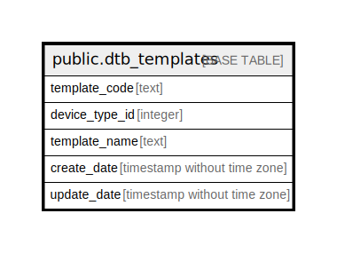

# public.dtb_templates

## Description

テンプレート情報

## Columns

| Name | Type | Default | Nullable | Children | Parents | Comment |
| ---- | ---- | ------- | -------- | -------- | ------- | ------- |
| template_code | text |  | false |  |  | テンプレートコード |
| device_type_id | integer |  | false |  | [public.mtb_device_type](public.mtb_device_type.md) | 端末種別ID |
| template_name | text |  | true |  |  | テンプレート名 |
| create_date | timestamp without time zone | CURRENT_TIMESTAMP | false |  |  | 作成日時 |
| update_date | timestamp without time zone |  | false |  |  | 更新日時 |

## Constraints

| Name | Type | Definition |
| ---- | ---- | ---------- |
| dtb_templates_pkey | PRIMARY KEY | PRIMARY KEY (template_code) |

## Indexes

| Name | Definition |
| ---- | ---------- |
| dtb_templates_pkey | CREATE UNIQUE INDEX dtb_templates_pkey ON public.dtb_templates USING btree (template_code) |

## Relations

---

> Generated by [tbls](https://github.com/k1LoW/tbls)
