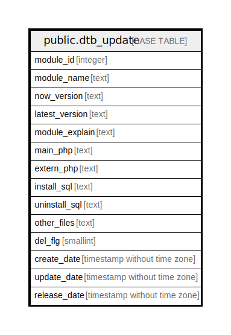

# public.dtb_update

## Description

モジュール更新情報

## Columns

| Name | Type | Default | Nullable | Children | Parents | Comment |
| ---- | ---- | ------- | -------- | -------- | ------- | ------- |
| module_id | integer |  | false |  | [public.dtb_module](public.dtb_module.md) | モジュールID |
| module_name | text |  | false |  |  | モジュール名 |
| now_version | text |  | true |  |  | インストールバージョン |
| latest_version | text |  | false |  |  | 最新バージョン |
| module_explain | text |  | true |  |  | 機能説明 |
| main_php | text |  | false |  |  | 更新対象パス |
| extern_php | text |  | false |  |  | 拡張対象パス |
| install_sql | text |  | true |  |  | インストールSQL |
| uninstall_sql | text |  | true |  |  | アンインストールSQL |
| other_files | text |  | true |  |  | その他拡張ファイル名 |
| del_flg | smallint | 0 | false |  |  | 削除フラグ |
| create_date | timestamp without time zone | CURRENT_TIMESTAMP | false |  |  | 作成日時 |
| update_date | timestamp without time zone |  | false |  |  | 更新日時 |
| release_date | timestamp without time zone |  | false |  |  | リリース日時 |

## Constraints

| Name | Type | Definition |
| ---- | ---- | ---------- |
| dtb_update_pkey | PRIMARY KEY | PRIMARY KEY (module_id) |

## Indexes

| Name | Definition |
| ---- | ---------- |
| dtb_update_pkey | CREATE UNIQUE INDEX dtb_update_pkey ON public.dtb_update USING btree (module_id) |

## Relations

---

> Generated by [tbls](https://github.com/k1LoW/tbls)
