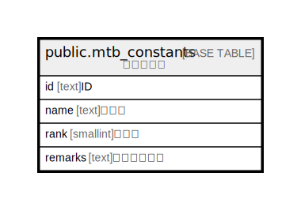

# public.mtb_constants

## Description

## Columns

| Name | Type | Default | Nullable | Children | Parents | Comment |
| ---- | ---- | ------- | -------- | -------- | ------- | ------- |
| id | text |  | false |  |  |  |
| name | text |  | true |  |  |  |
| rank | smallint | 0 | false |  |  |  |
| remarks | text |  | true |  |  |  |

## Constraints

| Name | Type | Definition |
| ---- | ---- | ---------- |
| mtb_constants_pkey | PRIMARY KEY | PRIMARY KEY (id) |

## Indexes

| Name | Definition |
| ---- | ---------- |
| mtb_constants_pkey | CREATE UNIQUE INDEX mtb_constants_pkey ON public.mtb_constants USING btree (id) |

## Relations

---

> Generated by [tbls](https://github.com/k1LoW/tbls)
