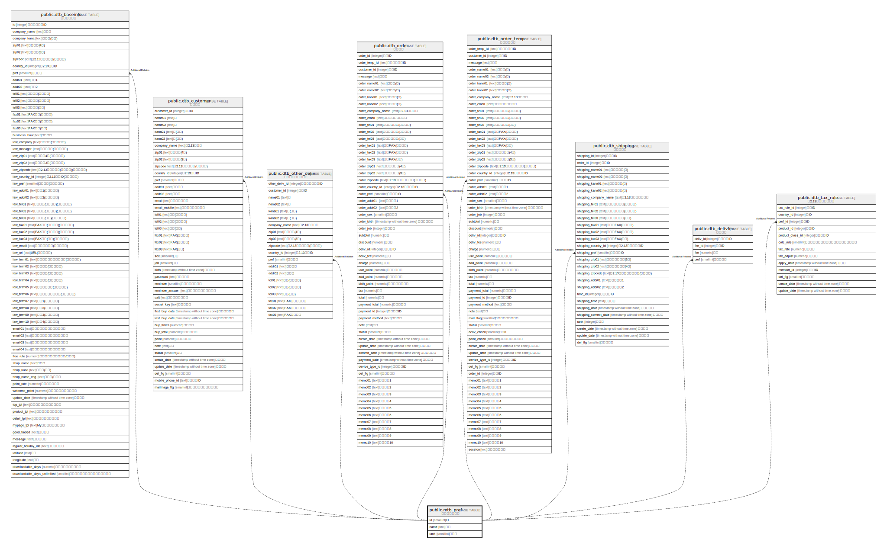

# public.mtb_pref

## Description

都道府県マスタ

## Columns

| Name | Type | Default | Nullable | Children | Parents | Comment |
| ---- | ---- | ------- | -------- | -------- | ------- | ------- |
| id | smallint |  | false | [public.dtb_baseinfo](public.dtb_baseinfo.md) [public.dtb_customer](public.dtb_customer.md) [public.dtb_other_deliv](public.dtb_other_deliv.md) [public.dtb_order](public.dtb_order.md) [public.dtb_order_temp](public.dtb_order_temp.md) [public.dtb_shipping](public.dtb_shipping.md) [public.dtb_delivfee](public.dtb_delivfee.md) [public.dtb_tax_rule](public.dtb_tax_rule.md) |  | ID |
| name | text |  | true |  |  | 名称 |
| rank | smallint | 0 | false |  |  | 表示順 |

## Constraints

| Name | Type | Definition |
| ---- | ---- | ---------- |
| mtb_pref_pkey | PRIMARY KEY | PRIMARY KEY (id) |

## Indexes

| Name | Definition |
| ---- | ---------- |
| mtb_pref_pkey | CREATE UNIQUE INDEX mtb_pref_pkey ON public.mtb_pref USING btree (id) |

## Relations

---

> Generated by [tbls](https://github.com/k1LoW/tbls)
