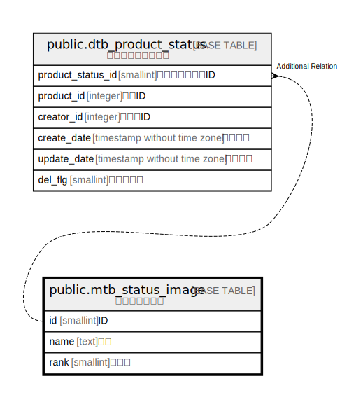

# public.mtb_status_image

## Description

ステータス画像

## Columns

| Name | Type | Default | Nullable | Children | Parents | Comment |
| ---- | ---- | ------- | -------- | -------- | ------- | ------- |
| id | smallint |  | false |  |  | ID |
| name | text |  | true |  |  | 名称 |
| rank | smallint | 0 | false |  |  | 表示順 |

## Constraints

| Name | Type | Definition |
| ---- | ---- | ---------- |
| mtb_status_image_pkey | PRIMARY KEY | PRIMARY KEY (id) |

## Indexes

| Name | Definition |
| ---- | ---------- |
| mtb_status_image_pkey | CREATE UNIQUE INDEX mtb_status_image_pkey ON public.mtb_status_image USING btree (id) |

## Relations

---

> Generated by [tbls](https://github.com/k1LoW/tbls)
