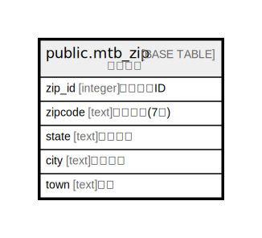

# public.mtb_zip

## Description

## Columns

| Name | Type | Default | Nullable | Children | Parents | Comment |
| ---- | ---- | ------- | -------- | -------- | ------- | ------- |
| zip_id | integer |  | false |  |  |  |
| zipcode | text |  | true |  |  |  |
| state | text |  | true |  |  |  |
| city | text |  | true |  |  |  |
| town | text |  | true |  |  |  |

## Constraints

| Name | Type | Definition |
| ---- | ---- | ---------- |
| mtb_zip_pkey | PRIMARY KEY | PRIMARY KEY (zip_id) |

## Indexes

| Name | Definition |
| ---- | ---------- |
| mtb_zip_pkey | CREATE UNIQUE INDEX mtb_zip_pkey ON public.mtb_zip USING btree (zip_id) |

## Relations

---

> Generated by [tbls](https://github.com/k1LoW/tbls)
